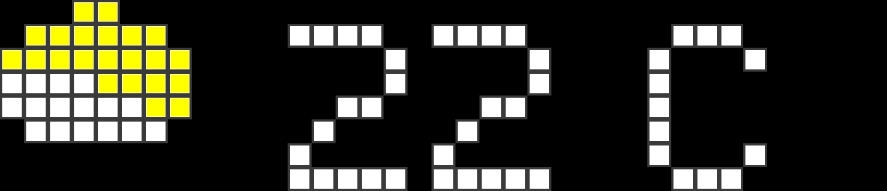
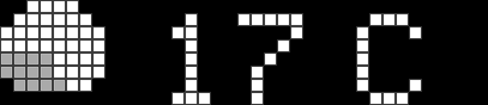
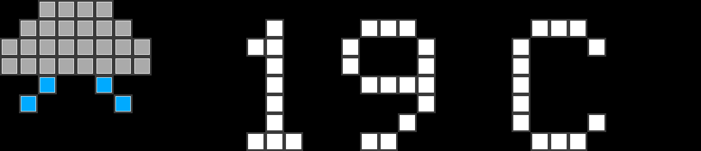
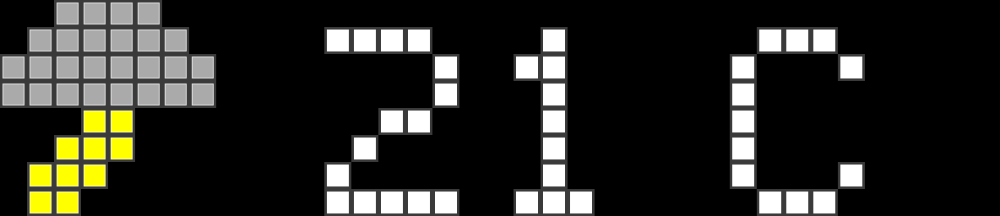
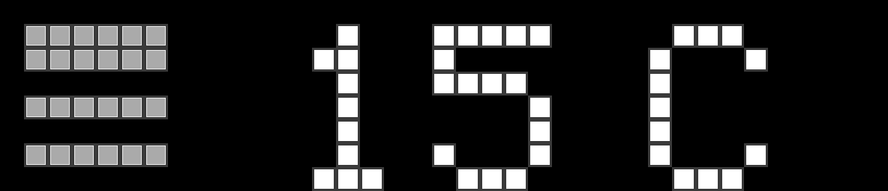

# Reloj Android

Turn an old Android phone into an always-on, LaMetric-style smart clock that
shows the time, weather, calendar, USD → PYG exchange rate, and a daily kanji.
Everything is configurable from a web UI served by the phone itself.


## Features

- **LaMetric-style pixel display** — virtual LED grid rendered with rounded,
  glowing pixels on a black background. Faces can use higher pixel densities
  (e.g. KanjiOfDay renders at 148×32) for detailed glyphs.
- **Rotating faces**
  - Clock with optional pixel-art / LaMetric icon
  - Weather for Asunción, Paraguay (Open-Meteo)
  - USD → PYG exchange rate (DolarPy)
  - Calendar with configurable date pattern
  - Kanji of the Day from kanjiapi.dev
- **Touch interactions**
  - Swipe left/right to jump between faces
  - Tap to refresh KanjiOfDay to the next kanji
- **Web config UI** at `http://<phone-ip>:8080`
  - Toggle faces
  - Set rotation interval
  - Override weather city / coordinates
  - Choose a kanji list (joyo, grade-1..6, jlpt-5..1)
  - Pick LaMetric-style icons for supported faces
  - Live preview of the current display
- **Always-on, fullscreen, landscape** — keeps the screen awake and hides system
  bars.
- **Extensible** — new faces are added by implementing a single interface.

## Requirements

- Android 14 (API 34) or newer
- Landscape orientation
- Recommended: phone plugged in and battery optimization disabled

## Build

```bash
./gradlew assembleDebug
```

Install on a connected device:

```bash
./gradlew installDebug
```

## Screenshots

Weather face reference images for all 9 WMO conditions (auto-generated from the
pixel-art definitions):

| Condition | Screenshot |
|-----------|------------|
| Clear Day |  |
| Clear Night |  |
| Partly Cloudy Day |  |
| Partly Cloudy Night |  |
| Cloudy |  |
| Rain |  |
| Snow |  |
| Storm |  |
| Fog |  |

### Generating screenshots

Unit tests under `app/src/test/java/com/example/relojandroid/screenshots/`
render each face directly from the `PixelMatrix` definitions to PNG. To regenerate
all weather screenshots:

```bash
./gradlew app:testDebugUnitTest --tests WeatherFaceScreenshotTest
```

Outputs are written to `app/build/screenshots/weather/` and also checked into
`docs/screenshots/weather/` for reference.

## Configure

```bash
./gradlew assembleDebug
```

Install on a connected device:

```bash
./gradlew installDebug
```

## Configure

1. Open the app on the phone.
2. Find the phone’s IP on your Wi-Fi network.
3. Visit `http://<phone-ip>:8080` from another device on the same network.
4. Toggle faces, change the rotation interval, adjust weather location, pick a
   kanji list, or choose pixel-art icons.

## REST API

| Method | Path | Description |
|--------|------|-------------|
| GET | `/api/settings` | Current settings |
| POST | `/api/settings` | Update settings |
| GET | `/api/faces` | List available faces |
| GET | `/api/status` | Current face and server port |
| GET | `/api/preview` | Current pixel grid as hex colors |
| GET | `/api/icons/categories` | Icon categories |
| GET | `/api/icons` | Search icons |
| GET | `/api/icons/{id}` | Icon details |
| GET | `/api/icons/{id}/thumbnail` | Icon thumbnail PNG |
| POST | `/api/icons/select` | Assign icon to a face |
| DELETE | `/api/icons/selected` | Clear assigned icon |
| GET | `/api/icons/selected` | Currently selected icon for a face |

## Architecture

```
MainActivity
  └── PixelClockScreen (Compose Canvas + gestures)
        └── FaceEngine
              ├── ClockFace
              ├── WeatherFace
              ├── ExchangeFace
              ├── CalendarFace
              └── KanjiOfDayFace
SettingsRepository (DataStore)
IconRepository (LaMetric icon cache)
WebServer (Ktor :8080)
```

## Extending

Add a new face:

1. Implement `Face` in `app/src/main/java/com/example/relojandroid/faces/`.
2. Register it in `AppModule.provideFaces()`.
3. The web UI will discover it automatically via `/api/faces`.

To add tap behavior, override `Face.onTap()`. To add new gestures, extend
`PixelClockScreen` and route events through `FaceEngine`.

See `AGENTS.md` for developer notes and `plan.md` for the original design.

## License

MIT — feel free to hack on it.
